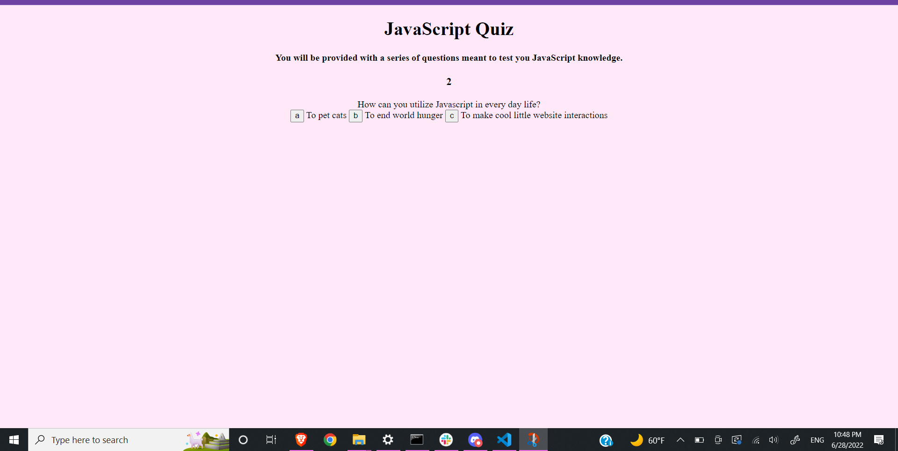
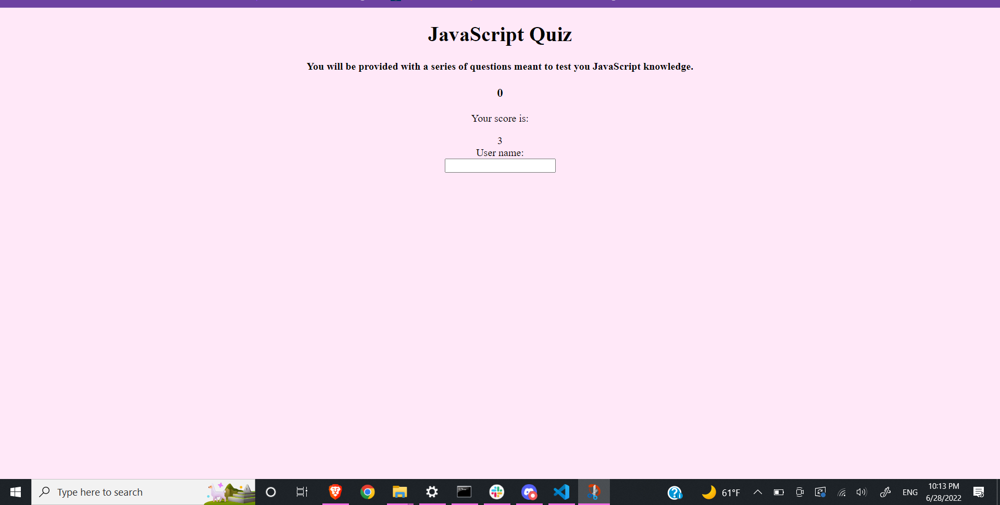

# code-quiz

## Deployment Link
<a href="https://pirosvs.github.io/code-quiz/">Click here to try out the quiz</a>

## Description



This project is an example of a dynamic quiz format, where the page continuously updates to show only the relevant information on the screen. The quiz itself displays knowledge of web APIs and dynamic JavaScript, where innerHTML and template literals are used to render content on the page while removing previous content. Usage of web API methods in JavaScript is preferred here over, for exmaple, writing directly in the HTML and hiding it in the CSS, as it makes the code appear neater and keeps the page from having to store content while it is not being displayed to the user. 

Skills used in the making of this project include basic HTML, CSS for the look of the page, and JavaScript to create interactive elements. In order to render elements on the page, this project uses template literals in combination with innerHTML in order to create the HTML in the JavaScript by updating the index of an array of questions and answers. Hence:

```
    output.push(
      `<div class="question"> ${currentQuestion.question} </div>
      <div class="answers"> ${answers.join('')} </div>`
    );
```
By making output an empty array, we are able to push the dictionaries for questions and answers into it in separate divs using template literal, and set it into the HTML with
```
  questionHTML = output;
```
A forEach function is also used to attach buttons to each answer. In order to maintain user score to generate a potential high scores list and attach it to a given username, localStorage is used for the final score count after the quiz has ended, using JSON.stringify in order to render it viable for storage, and an input form is attached to take in the username from user input.

## Credits
Credit to my girlfriend and my housemate for helping me immensely with this project, particularly with the string literal, a number of fixes to each function, and with the emotional support to work on this project.

## License
This project falls under the MIT License.

## Author
Damien Armstrong can be found on: <a href="https://www.linkedin.com/in/damien-armstrong-412319138/">Linkedin</a>, <a href="https://github.com/pirosvs">Github</a>